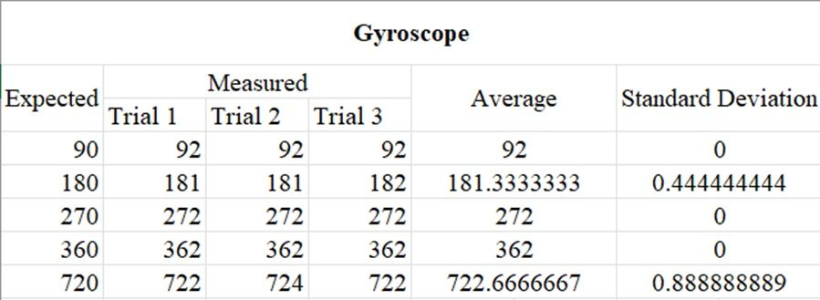
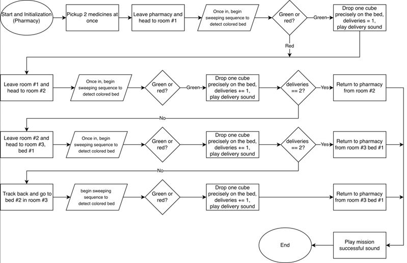
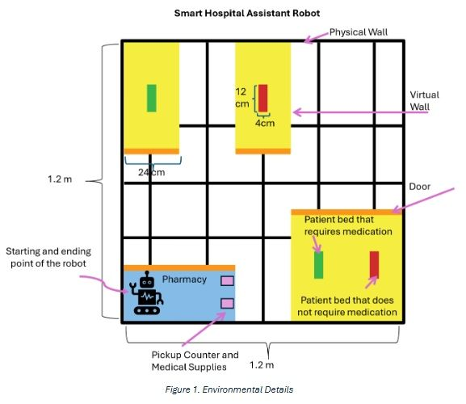
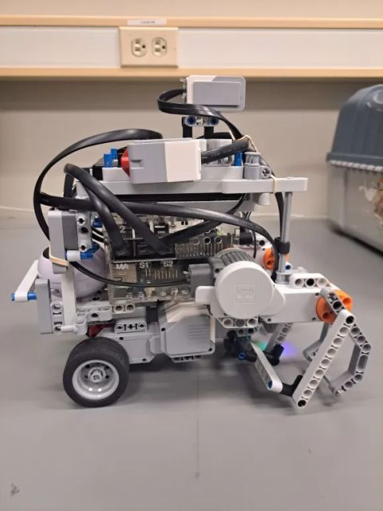
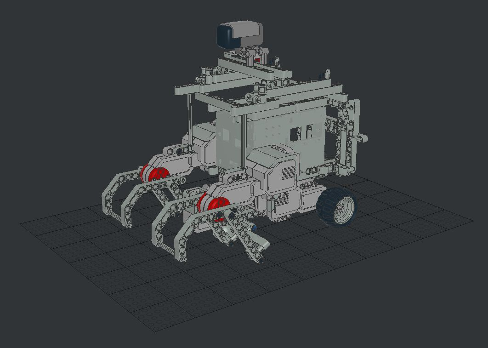
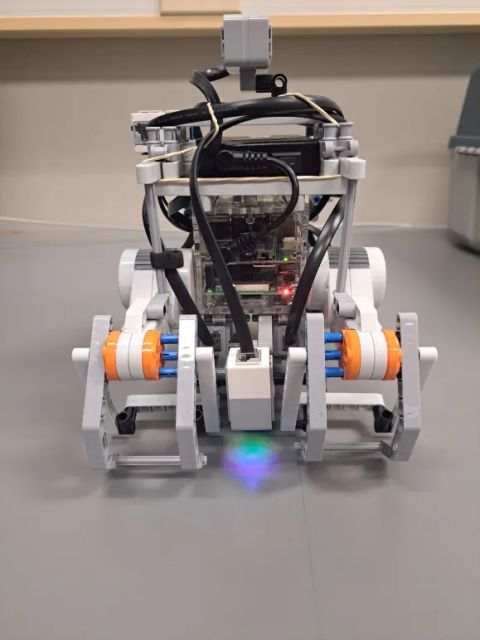

# Autonomous Navigation Robot

An autonomous robot built using a Raspberry Pi and sensor-based navigation logic to detect obstacles and navigate its environment in real time.

## Overview

This project focused on developing the software and control logic for a Raspberry Pi-based autonomous navigation robot. The system processes sensor input to detect obstacles, adjust movement, and improve navigation behavior through iterative testing and debugging.

The project emphasized embedded systems concepts, sensor integration, real-time decision making, and system validation. The robot autonomously navigates indoor environments while avoiding obstacles and responding to environmental cues through sophisticated sensor fusion and decision-making algorithms.

---

## Features

* **Real-time obstacle detection** - Continuous sensor monitoring for dynamic obstacle avoidance
* **Color-based navigation** - Bed detection and identification using RGB color sensing
* **Multi-sensor integration** - Combines ultrasonic, color, and touch sensors for robust navigation
* **Emergency safety system** - Touch-activated emergency stop for safe operation
* **Autonomous delivery logic** - Path planning and navigation to target destinations
* **Sensor data processing and analysis** - Robust filtering and normalization of sensor readings
* **Embedded hardware integration** - Direct control of motors and sensors via Raspberry Pi
* **Iterative testing and debugging** - Refined through extensive real-world testing

---

## Technologies Used

* **Python** - Core application logic and control systems
* **Raspberry Pi** - Hardware platform (GPIO, PWM motor control)
* **Embedded Systems** - Real-time sensor processing and motor control
* **Sensor Integration** - Ultrasonic distance sensors, RGB color sensor, touch sensor
* **Robotics** - Navigation algorithms, obstacle avoidance, path planning
* **Threading** - Concurrent sensor monitoring and emergency stop handling
* **Hardware Abstraction** - Modular driver layer for hardware components

---

## Project Architecture

### Core Modules

| Module | Purpose |
|--------|---------|
| `main.py` | Entry point; initializes robot and orchestrates main navigation loop |
| `hardware.py` | Hardware abstraction layer; manages motors, sensors, and GPIO |
| `navigation.py` | Navigation algorithms; path planning and movement logic |
| `detection.py` | Color detection and bed identification algorithms |
| `sensors.py` | Sensor interface and data collection |
| `delivery.py` | Delivery logic and destination handling |
| `utils/` | Utility modules for sound, telemetry, filtering, and hardware drivers |

### System Workflow

```
1. Initialize hardware (motors, sensors, GPIO)
2. Start emergency stop monitoring thread
3. Main navigation loop:
   - Read sensor data (distance, color, touch)
   - Detect obstacles in path
   - Identify colored beds/targets
   - Plan and execute navigation commands
   - Process delivery tasks
4. Emergency stop thread:
   - Monitor touch sensor
   - Halt all motors on activation
   - Signal clean shutdown
```

---

## System Functionality

The robot continuously collects data from onboard sensors and uses this information to make real-time navigation decisions.

### Main Workflow

1. **Sensor Reading** - Ultrasonic sensors measure distance, color sensor detects environment
2. **Data Processing** - Normalize and filter sensor readings for robustness
3. **Environmental Analysis** - Detect obstacles and identify colored targets
4. **Decision Making** - Determine optimal movement based on sensor data
5. **Motor Control** - Execute movement commands (forward, turn, stop)
6. **Real-time Loop** - Repeat at high frequency for responsive navigation

### Key Features

* **Color Detection** - Identifies red and green beds using RGB normalization and reference matching
* **Obstacle Avoidance** - Monitors distance sensors and adjusts path to avoid collisions
* **Emergency Safety** - Touch sensor allows immediate shutdown from any state
* **Motor Precision** - PWM-based speed control for smooth, accurate movement
* **Threading** - Parallel monitoring ensures safety thread runs independently

The navigation logic was refined through extensive testing and performance validation to improve reliability and responsiveness in real-world conditions.

---

## Installation & Setup

### Requirements

* Raspberry Pi 3/4
* Python 3.7+
* Required libraries: RPi.GPIO, smbus, math, threading

### Hardware Components

* Motor drivers and control circuitry
* Ultrasonic distance sensors
* RGB color sensor
* Touch sensor for emergency stop
* DC motors with encoders

### Setup Instructions

1. Clone or download the project files
2. Ensure all dependencies are installed on the Raspberry Pi
3. Connect all sensors and motors to GPIO pins as configured in `hardware.py`
4. Run `python main.py` to start the robot

---

## Key Implementation Details

### Sensor Integration

* **Ultrasonic Sensors** - Measure distance to obstacles in real-time
* **Color Sensor** - Detects RGB values; normalized against reference values for bed identification
* **Touch Sensor** - Emergency stop button with high-priority thread monitoring

### Motor Control

* **PWM Control** - Precise speed adjustment for smooth acceleration/deceleration
* **Wheel Calibration** - `WHEEL_CIRCUMFERENCE = 3.14159 * 4.3` for accurate distance tracking
* **Degree Calculation** - `DEGREES_PER_CM = 360.0 / WHEEL_CIRCUMFERENCE` for rotation precision

### Color Detection Algorithm

* Reference color values for green and red beds stored as normalized RGB
* Color matching threshold of 0.15 for tolerance in varying lighting
* Calculates normalized RGB distances to identify target colors

### Safety Features

* Emergency stop thread runs continuously and independently
* Touch sensor monitoring at 0.01s intervals for quick response
* Hard stop of all motors on emergency trigger
* Thread-safe flag system for clean shutdown

---

## Challenges

Some of the main challenges during development included:

* **Inconsistent sensor readings** - Solution: Implemented filtering and normalization algorithms
* **Real-time debugging** - Solution: Developed telemetry and logging systems for analysis
* **Navigation accuracy** - Solution: Calibrated wheel constants and encoder feedback
* **Color detection reliability** - Solution: Normalized RGB values against reference standards
* **Responsiveness** - Solution: Optimized sensor polling rates and threading model
* **Hardware integration** - Solution: Built robust abstraction layer for hardware components

These challenges helped strengthen debugging, testing, and embedded systems development skills.

---

## What I Learned

Through this project, I gained experience with:

* **Embedded software development** - Writing Python for real-time hardware control
* **Real-time sensor processing** - Multi-threaded sensor monitoring and data fusion
* **Robotics system debugging** - Testing and validating autonomous behavior
* **Hardware/software integration** - Bridging GPIO, sensors, and application logic
* **Iterative testing and validation** - Refining algorithms through field testing
* **Threading and concurrency** - Managing parallel tasks safely
* **Sensor calibration and normalization** - Handling real-world sensor variability
* **Motor control and precision** - PWM-based movement accuracy

---

## Future Improvements

Potential future improvements include:

* **Advanced pathfinding** - Implement A* or Dijkstra's algorithms for optimal navigation
* **Sensor fusion** - Combine multiple sensor modalities for more robust obstacle detection
* **SLAM (Simultaneous Localization and Mapping)** - Build internal environment maps
* **Wireless monitoring and control** - Remote operation via network interface
* **Machine learning** - Train models for improved decision-making
* **Enhanced obstacle avoidance** - Implement more sophisticated reactive behaviors
* **Performance optimization** - Faster response times through algorithm optimization
* **Telemetry dashboard** - Real-time visualization of robot state and sensor data

---

## Media

### Robot and System Images













---

## File Structure

```
Robot Software/
├── main.py                 # Entry point and main navigation loop
├── hardware.py             # Hardware abstraction layer
├── navigation.py           # Navigation algorithms and path planning
├── detection.py            # Color detection and bed identification
├── sensors.py              # Sensor interfaces and data collection
├── delivery.py             # Delivery task logic
├── test_color.py           # Color sensor testing and calibration
├── utils/
│   ├── __init__.py
│   ├── brick.py            # Brick/hardware driver
│   ├── dummy.py            # Dummy implementations for testing
│   ├── filters.py          # Sensor data filtering
│   ├── remote.py           # Remote control interface
│   ├── rmi.py              # Remote method invocation
│   ├── sound.py            # Audio feedback system
│   └── telemetry.py        # Data logging and telemetry
└── README.md               # This file
```

---

## Notes

* Emergency stop should be checked frequently during operation
* Sensor calibration is critical for reliable color detection
* Motor speed values may need adjustment based on surface conditions
* Regular testing is recommended to validate behavior in new environments

---

## Team Information

**Project:** Autonomous Navigation Robot  
**Date:** Week 5 Final Version  
**Platform:** Raspberry Pi  
**Language:** Python  

For questions or additional information about the implementation, refer to the inline documentation in each module.
